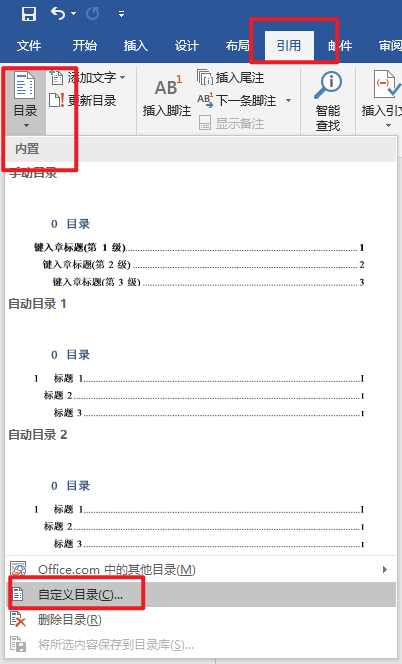
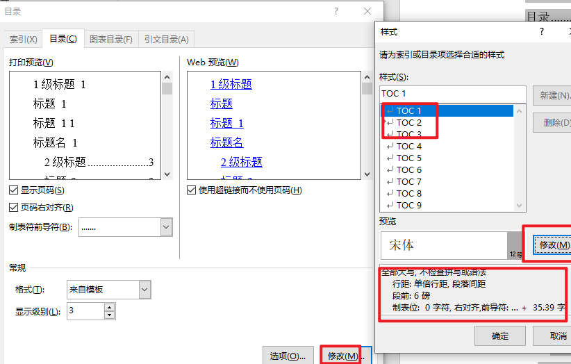
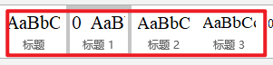
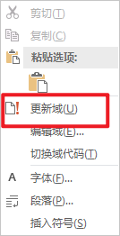

## 毕设论文格式

#### 页眉

双页打印-选择奇偶页不同

页眉上的横线插入：

先打开页眉，然后选择边框底纹。应用于段落，选择样式，放置下面。

奇数页选择：北京交通大学硕士学位论文

要想上下节页眉不同，需要在每一节或者每一个你想区分页眉的地方，在布局----分页符----插入分节符下一页。然后双击页眉取消链接到前一条页眉

#### 页码

页码设置，分为正文和前面的部分。正文用阿拉伯数字，前文用希腊数字。要想页码不同需要中间插入分节符。

然后在正文第一页，插入页码。选择从1开始。

后续续前节就行 或者 会自动生成页码。

在希腊文字这里

奇数页是插入页码，然后选择页码格式 起始页设置为i。偶数页第二页，插入页码，续前节即可。

#### 图、表索引

在每一个图片处插入题注，题注会跟随文章的题号变换而变换。

首先新建标签，选择题注编号，编号这里要选择章节其实样式。所以这要求我们章节的每一个大标题要样式选择多级列表

这样设置好，将每一章节编好。然后再插入题注

最后插入表目录自动生成

[题注参考视频](https://v.qq.com/x/page/w0389rwwct8.html)

[参考文章](https://blog.csdn.net/Dontla/article/details/122472712)

#### 交叉索引

在引用里面可以设置交叉索引

多个引用修改代码：[参考链接](https://blog.csdn.net/dally2/article/details/128619537)

#### 目录

目录的更新首先，要去引用里面

然后设置三级目录格式

接着每一章节的一级、二级、三级目录都需要统一，否则更新后会字体变复杂，统一用下面的多级列表 标题规范格式

更新目录

